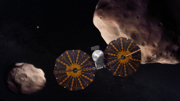

Getting started
###############

In this getting started, we will discover qjoin by practice and manipulate collections as if they came from complementary sources or even from code directly, for example in the form of a simulation algorithm.

qjoin will allow us to merge more collections into a single data source that we can easily manipulate with functional python operations such as list comprehension or the operators of the itertools module.

    Space adventure

.. code-block:: python
    :caption: ./spacecraft.py

    spacecrafts = [
        {'name': 'Kepler', 'cospar_id': '2009-011A', 'satcat': 34380},
        {'name': 'GRAIL (A)', 'cospar_id': '2011-046', 'satcat': 37801},
        {'name': 'InSight', 'cospar_id': '2018-042a', 'satcat': 43457},
        {'name': 'lucy', 'cospar_id': '2021-093A', 'satcat': 49328},
        {'name': 'Psyche', 'cospar_id': None, 'satcat': None},
    ]

    spacecrafts_mission_infos = [
        {'mission': 'Kepler', 'mission_type': 'Space telescope', 'launch_date':'2009-03-07T03:49Z', 'end_of_mission': '2018-11-15'},
        {'mission': 'GRAIL (A)', 'launch_date':'2011-09-10T13:08Z', 'end_of_mission': '2012-12-17'},
        {'mission': 'InSight', 'mission_type': 'Mars lander', 'launch_date':'2018-05-05T11:05Z', 'end_of_mission': '2022-12-21'},
        {'mission': 'lucy', 'mission_type': 'Multiple-flyby of asteroids', 'launch_date':'2021-10-16T09:34Z'},
    ]

    spacecraft_properties = [
        {'name': 'Kepler', 'dimension': (4.7, 2.7, None), 'power': 1100, 'launch_mass': 1052.4},
        {'name': 'GRAIL (A)', 'launch_mass': 202.4},
        {'name': 'InSight', 'dimension': (6, 1.56, 1), 'power': 600, 'launch_mass': 694},
        {'name': 'lucy', 'dimension': (13, None, None), 'power': 504, 'launch_mass': 1550},
    ]

    class SpacecraftAlgorithm:
        def __init__(self, name: str, power_simulation: Callable[[], None], torque_simulation: Callable[[], None]):
            self.name = name
            self.power_simulation = power_simulation
            self.torque_simulation = torque_simulation

    spacecrafts_algorithm = [
        SpacecraftAlgorithm('Kepler', lambda: None, lambda: None),
        SpacecraftAlgorithm('GRAIL (A)', lambda: None, lambda: None),
        SpacecraftAlgorithm('InSight', lambda: None, lambda: None),
        SpacecraftAlgorithm('Psyche', lambda: None, lambda: None),
        SpacecraftAlgorithm('Kepler', lambda: None, lambda: None),
    ]

Installation
************

.. code-block:: bash

    pip install qjoin

Merge collections from a common key
***********************************

.. code-block:: python
    :caption: ./1_fusion_common_key.py

    global_space_crafts = qjoin.on(spacecrafts).join(spacecrafts_properties, key='name')
    for spacecraft, spacecraft_properties in global_space_crafts:
        print(spacecraft['name'])
        print('-' * len(spacecraft['name']))
        print(spacecrafts_property['dimension'])
        print('')
        print('')

Merge collections with a key is on 2 different attributes
*********************************************************

.. code-block:: python
    :caption: ./2_fusion_different_key_attribute.py

    global_space_crafts = qjoin.on(spacecrafts).join(spacecrafts_mission_infos, left='name', right='mission')
    for spacecraft, spacecraft_mission_infos in global_space_crafts:
        print(spacecraft['name'])
        print('-' * len(spacecraft['name']))
        print(spacecrafts_mission_info.get('launch_date', 'N/D'))
        print('')
        print('')

Merge collections from artificial key
*************************************

.. code-block:: python
    :caption: ./3_fusion_artificial_key.py

    global_space_crafts = qjoin.on(spacecrafts).join(spacecrafts_mission_infos, left=lambda s: s.name.lower(), right=lambda s: s.mission.lower())
    for spacecraft, spacecraft_mission_infos in global_space_crafts:
        print(spacecraft['name'])
        print('-' * len(spacecraft['name']))
        print(spacecrafts_mission_info.get('launch_date', 'N/D'))
        print('')
        print('')

Merge collections and encapsulate them in a class instance
**********************************************************

.. code-block:: python
    :caption: ./4_fusion_as_aggregate.py

    @dataclasses.dataclass
    class SpacecraftAggregate:
        spacecraft: dict = dataclasses.field(init=False)
        spacecraft_mission_infos: dict = dataclasses.field(init=False)
        spacecraft_properties: dict = dataclasses.field(init=False)

        @property
        def name:
            return self.spacecraft['name']

        def __post_qjoin__(self):
            """
            If this method is present, it will be invoked after qjoin has created the object.
            """
            print(self.spacecraft['name'])

        def __str__(self):
            return f'{self.name} - (mission: { self.spacecraft_mission_infos.get("mission_type", "N/D") }'

    spacecrafts_aggregates = qjoin.on(spacecrafts)
        .join(spacecrafts_mission_infos, left=lambda s: s['name'].lower(), right=lambda s: s['mission'].lower())
        .join(spacecrafts_properties, key='name')
        .as_aggregate(SpacecraftAggregate, ['spacecraft', 'spacecraft_mission_infos', 'spacecraft_properties'])])

    for spacecraft_aggregate in spacecrafts_aggregates:
        print(spacecraft_aggregate)

