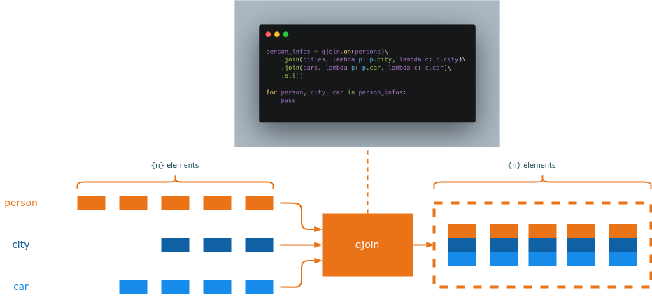

qjoin
=====

qjoin is a data manipulation library that provides simple and efficient joining and collection processing functionality. It simplifies and optimizes the process of joining different entities and provides methods for aggregating, organizing, and sorting data.

* qjoin is a simple and efficient way to join and process data
* qjoin is a steroid extension of the `zip` function in python
* qjoin works on all iterators, whether lists of dictionaries, objects or sqlalchemy or django models

   principle diagram

.. toctree::
   :maxdepth: 1

   getting_started
   api
